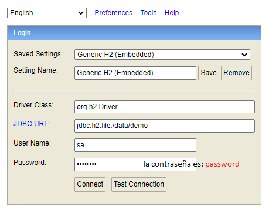

## Hosting & keep-alive

- La app se encuentra desplegada en https://render.com/
 

- La base de datos se almacena en https://aiven.io/

- Utiliza https://keepalive.dashdashhard.com/ para mantener la instancia del servidor activa

## Correr aplicación localmente

Si se quiere utilizar la applicación, es necesario descomentar la linea ``spring.profiles.active=local`` que se encuentra en el archivo ``application.properties`` (*src/main/resources/application.properties*)

De esta manera se habilita una base de datos embebida *H2 Database Engine*, permitiendo correr la app de diferentes maneras:

### Opción 1
Abrir el proyecto con un IDE y ejecutar el método **main** en la ruta *src/main/java/exa/arqweb/tp3/Main.java*

### Opción 2
Ejecutar la app a través de un command-line interpreter

  - **Windows**: En la ruta del proyecto abrir cmd.exe y ejecutar:
  
    `
     mvnw.cmd spring-boot:run
    `
  

  - **Linux / MacOS**: En la ruta del proyecto abrir una terminal y ejecutar:

    `
     ./mvnw spring-boot:run
    `
  
    (no olvidar el punto "." al principio del comando)

## Servicios
Una vez iniciada la app, es posible probar los servicios localmente a través del siguiente link: http://localhost:8080/swagger-ui/index.html

## H2 Database Engine
Es posible acceder a la base de datos local desde un navegador web http://localhost:8080/h2-console (configurando el login como se muestra en la siguiente imagen)

## Tests
La aplicación cuenta con algunos tests, que se pueden ejecutar a través de linea de comandos:

- **Windows**: En la ruta del proyecto abrir cmd.exe y ejecutar:

  `
  mvnw.cmd test
  `

- **Linux / MacOS**: En la ruta del proyecto abrir una terminal y ejecutar:

  `
  ./mvnw test
  `

## A tener en cuenta

⚠️ Si se van a realizar cambios en el código, tener en cuenta los dos siguientes puntos antes de subir las modificaciones al repositorio remoto (GitHub)

- Desactivar la linea ``spring.profiles.active=local`` en el archivo ``application.properties`` (o sea, dejarla comentada con el simbolo # al principio de la linea)

- Luego ejecutar el comando

  ``./mvnw clean install -DskipTests``

  (no olvidar el punto al principio)

## TO DO

- Allow attributes "edad", "dni", "fecha_nacimiento" to be null in database
- Allow multiple constructors to create student
- Store "edad" when saving student (calculate it from birthdate)  
- Display custom error responses when DateTimeParseException occurs
- Fix "api/estudiantes?sort=apellido" doesn't fetch "fecha_nacimiento"
- Check if by doing './mvnw package' a SNAPSHOT.jar gets generated. If so, deploy it to the host server and see if the app still works